<h1 align="center">Monish Raaj Selvanathan</h1>

&nbsp;&nbsp;

<picture>
  <source media="(prefers-color-scheme: dark)" srcset="assets/readme-dark.svg">
  
</picture>

AI developer working across web, ML and data.
I build agents, train models, clean up data and ship the web apps around them.

<picture>
  <source media="(prefers-color-scheme: dark)" srcset="assets/monitor-dark.svg">
  
</picture>

- **Now:** M.Tech at NIT Calicut
- **Before:** worked as an AI developer, building agents
- **Lately:** taking hardware apart

<picture>
  <source media="(prefers-color-scheme: dark)" srcset="assets/stack-dark.svg">
  
</picture>

> Co-authored [a paper](https://ieeexplore.ieee.org/document/10914937/) at IEEE WIECON-ECE 2024.

**Next level:** [my website](#) boots MonishOS in your browser.
Fly around the map and scan all 8 sections to clear it, or flip to
read mode for the plain version. My projects live there too.
